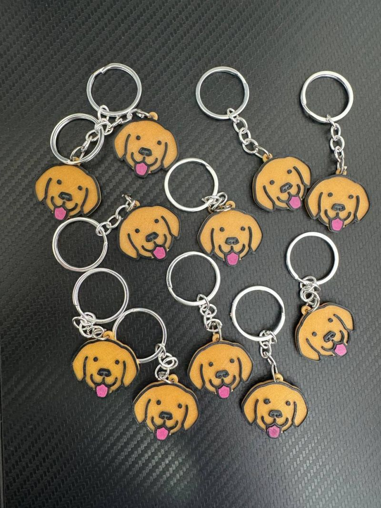

# bruno-keychain
3D printable keychain desgin, for [Bruno](https://www.usebruno.com/) - an open source 100% offline API client with a cute logo and more!

This project is fan art, basically going from the 2D logo -

to 3D prints (photo credit: [Anoop](https://www.helloanoop.com/), lead developer of Bruno)

# Design Files

Inkscape and FreeCAD were used for this project.

14F36.svg is the vector logo. It's built out of shapes and wide lines. As a shortcut, I used bitmap tracing in Inkscape to convert it to vector. This is essentially a hack to quickly convert the wide lines into a shape. Also added a circular hole to fit a keyring.  The dimensions of the keychain - roughly 3.5 cm x 3 cm - are also decided in the 2D file (see layered-bruno-logo.svg):

Next, this is imported into FreeCAD as geometry. FreeCAD doesn't handle shapes with holes, so you need to manually apply booleans. Extrude each of the shapes to an appropriate height. I choose 2 mm for the base, and 0.5 mm increments for each of the other three colors - gray, black and pink. If you open bruno-keychain-3d.FCStd, you'll see some boolean artifacts, which looks like a bug to me. Luckily it didn't affect the STL export.

Finally, I used Prusa Slicer, arranged 12 on the printer bed. 12 pieces in one shot take 5.5 hrs (see 12xbruno-keychain-3d.3mf)

For best results and high fidelity shapes, I always use a fine 0.25 mm nozzle. 0.15 mm layers is good enough. Half an hour of print time per keychain is worth it.

# Filaments

I got lucky in this case - I happened to have filaments with reasonably close colours.

The following colored filaments were used - all from colorfab, material nGen :
 
* Base - Gold Metallic. It doesn't look anything like gold IMHO - but does the job well here
* Black
* Gray
* Pink

The colors look great, and it's a design that did bring a smile to my face! And of course the same for everyone who got one I hope. Credits to the original designer Sofie Ascherl. Many other [OpenMoji designs from the same author](https://openmoji.org/library/#author=Sofie%20Ascherl) look interesting as well.

After the print, all that remains to be done is minor cleanup and attaching the keyrings!

Developers and users of Bruno have everything in this repository to change things to suit their needs.

# Thoughts on Logo Design

I am not a graphic designer.' That said, I've been converting 2D logos to 3D for more than 20 years now - for computer screens, game engines/animations and 3D printing. Thus far, I've been lucky to have enjoyed sufficient creative freedom to tweak things slightly without running afoul of brand guidelines.

Now that 3D printing has become this much mainstream (not to mention the hype around AR/VR, etc) I do wish logo designers start considering 3D aspects as well. Ideally there would be 3D artwork that can be easily 3D printed. A step further would be RAL colors for accurate reproduction across print and the physical world.
